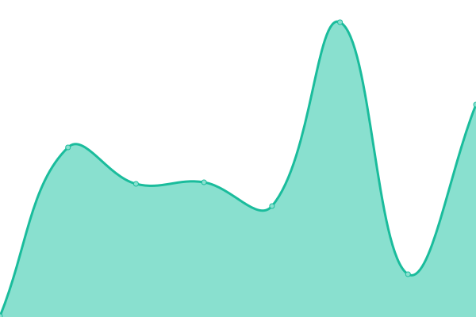
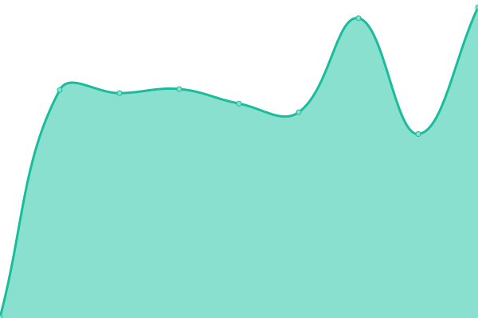

# [📈 Live Status](https://ranjithkumar-clockhash.github.io/clockhashuptime): <!--live status--> **🟩 All systems operational**

This repository contains the open-source uptime monitor and status page for [ranjithkumar-clockhash](https://ranjithkumar-clockhash.github.io/clockhashuptime), powered by [Upptime](https://github.com/upptime/upptime).

With [Upptime](https://upptime.js.org), you can get your own unlimited and free uptime monitor and status page, powered entirely by a GitHub repository. We use [Issues](https://github.com/ranjithkumar-clockhash/clockhashuptime/issues) as incident reports, [Actions](https://github.com/ranjithkumar-clockhash/clockhashuptime/actions) as uptime monitors, and [Pages](https://ranjithkumar-clockhash.github.io/clockhashuptime) for the status page.

<!--start: status pages-->
<!-- This summary is generated by Upptime (https://github.com/upptime/upptime) -->
<!-- Do not edit this manually, your changes will be overwritten -->
<!-- prettier-ignore -->
| URL | Status | History | Response Time | Uptime |
| --- | ------ | ------- | ------------- | ------ |
|  [Clockhash.com](https://clockhash.com/) | 🟩 Up | [clockhash-com.yml](https://github.com/ranjithkumar-clockhash/clockhashuptime/commits/HEAD/history/clockhash-com.yml) | 

 331ms
     
 | 

<a href="https://ranjithkumar-clockhash.github.io/clockhashuptime/history/clockhash-com">100.00%</a>
    

|  [Clockhash Wiki](https://wiki.clockhash.com/) | 🟩 Up | [clockhash-wiki.yml](https://github.com/ranjithkumar-clockhash/clockhashuptime/commits/HEAD/history/clockhash-wiki.yml) | 

 178ms
     
 | 

<a href="https://ranjithkumar-clockhash.github.io/clockhashuptime/history/clockhash-wiki">100.00%</a>
    

|  [Clockhash API](https://api.clockhash.com/) | 🟩 Up | [clockhash-api.yml](https://github.com/ranjithkumar-clockhash/clockhashuptime/commits/HEAD/history/clockhash-api.yml) | 

 505ms
     
 | 

<a href="https://ranjithkumar-clockhash.github.io/clockhashuptime/history/clockhash-api">100.00%</a>
    

<!--end: status pages-->

[**Visit our status website →**](https://ranjithkumar-clockhash.github.io/clockhashuptime)

## 📄 License

- Powered by: [Upptime](https://github.com/upptime/upptime)
- Code: [MIT](./LICENSE) © [Anand Chowdhary](https://anandchowdhary.com), supported by [Pabio](https://pabio.com)
- Data in the `./history` directory: [Open Database License](https://opendatacommons.org/licenses/odbl/1-0/)
